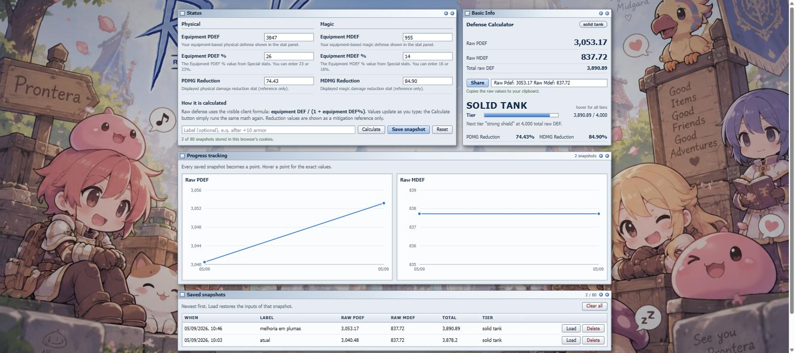

# roo-calc — Ragnarok Origin Defense Calculator

A small, static web app that turns the **Equipment PDEF / MDEF** numbers from your
Ragnarok Origin character sheet into **Raw PDEF / Raw MDEF**, keeps a history of the
values you save, and charts your progress over time. Everything is stored in your
browser's cookies; nothing is sent to a server.

The look imitates the windows of the classic Ragnarok Online client. The page was
created with inspiration from the original
[Defense Calculator (roo-calc.vercel.app)](https://roo-calc.vercel.app/).



## Features

- **Raw DEF from equipment stats** using the client formula
  `equipment DEF / (1 + equipment DEF%)`, recalculated as you type (a *Calculate*
  button is there for people who like pressing one).
- **Remembers your last inputs** between visits.
- **Snapshots**: press *Save snapshot* (optionally with a label such as
  "after +10 armor") to record the current values with a timestamp.
- **Progress charts** of Raw PDEF and Raw MDEF across your snapshots, plus a table
  where you can reload or delete any snapshot.
- **Tier ladder**: the total raw DEF (PDEF + MDEF) is graded from *holding sandal
  mode* up to *peak tank*, with an EXP-style bar showing how far the next tier is.
  Hover the tier name to see every range.
- **Share** button: copies `Raw Pdef: {value} Raw Mdef: {value}` to your clipboard,
  ready to paste into the game chat.
- **Cookies only**: no accounts, no backend, no tracking.

## How to use

1. Open your character details in game and click **PDEF** and **MDEF** in the
   General Stats tab. Note the *Equipment PDEF* and *Equipment MDEF* values.
2. In *Special stats*, note **Equipment PDEF %** and **Equipment MDEF %**
   (type `23` or `23%`, both work).
3. Optionally fill **PDMG / MDMG Reduction**. They are shown as a reference only and
   do not affect the raw DEF.
4. Read the results in the **Basic Info** window, press **Save snapshot** whenever
   your gear changes, and watch the charts grow.

## Where the data lives

All cookies use the `roo.` prefix, `SameSite=Lax`, `path=/` and expire after one
year. Clearing the site's cookies wipes everything.

| Cookie | Content |
|--------|---------|
| `roo.def.inputs` | The last values typed in the Status window |
| `roo.def.history` | Saved snapshots (timestamp, label, inputs) |

Implementation notes (`src/lib/cookies.ts`, `src/lib/codec.ts`):

- A single cookie holds about 4 KB, so each key is split into `key.0`, `key.1`, …
  with the chunk count in `key.n` (up to 8 chunks of 3000 characters).
- Records use a compact `field|field|…` / `record~record` layout instead of JSON,
  which triples in size once escaped for cookies.
- History is capped at **80 snapshots**; the oldest is dropped when the cap is
  reached. Browsers send every cookie with every request, and very large headers
  get rejected by servers and CDNs, hence the cap.
- The field order in `DEFENSE_FIELDS` (`src/lib/defense.ts`) is the on-disk format.
  Never reorder it; add new fields at the end. The layout used by the first version
  (which also stored Ignore PDEF/MDEF) is still readable.

## Development

```bash
npm install
npm run dev        # http://localhost:5173
npm test           # vitest: formulas, codecs, cookie store, share text
npm run build      # tsc --noEmit + vite build -> dist/
npm run preview    # serve the production build
```

Stack: React 19 · TypeScript · Vite 7 · Recharts 3 · Vitest 3 (jsdom).
The UI is English; docs and commit messages are in Portuguese.

### Project layout

```
public/bg/prontera.jpg     background artwork
src/
  lib/
    defense.ts             formulas and tier ladder (faithful port of the original site)
    cookies.ts             chunked, escaped cookie key/value store
    codec.ts               compact record serialization
    history.ts             useCookieState / useCookieHistory hooks
    persistence.ts         input/snapshot codecs, cookie keys, legacy layout
    share.ts               Share text + clipboard copy (write only, never reads)
    format.ts              number and date formatting
    *.test.ts              unit tests
  components/
    DefenseCalculator.tsx  assembles the windows
    RoWindow.tsx           classic-client window chrome (title bar + body)
    Field.tsx              StatRow (Status window line) and Meter (HP/EXP-style bar)
    TierPanel.tsx          tier name, bar and the hover ladder
    TrendChart.tsx         line chart (Recharts)
    HistoryTable.tsx       snapshot table (load / delete / clear)
    SaveControls.tsx       label input, Calculate, Save snapshot, Reset
    ShareButton.tsx        copies the share text to the clipboard
  App.tsx, main.tsx, styles.css
```

### Deploying

It is a static Vite site. On Vercel, import the repository and keep the *Vite*
preset (`npm run build`, output `dist/`). Any static host works.

## Credits

- Formulas and field descriptions come from the original
  [Defense Calculator](https://roo-calc.vercel.app/); this project adds persistence,
  snapshots, charts and the classic-client look.
- Fan-made tool. Ragnarok Online, Ragnarok Origin and related artwork are
  © Gravity Co., Ltd. Not affiliated with or endorsed by Gravity.

---

## Resumo em português

Calculadora de defesa do **Ragnarok Origin**: converte Equipment PDEF/MDEF (e os %)
em **Raw PDEF / Raw MDEF**, lembra o que você digitou, salva *snapshots* com data e
rótulo, mostra gráficos da evolução e classifica a defesa total em patamares (de
*holding sandal mode* a *peak tank*). O botão **Share** copia
`Raw Pdef: {valor} Raw Mdef: {valor}` para colar no chat do jogo.

Tudo fica nos **cookies do navegador** (prefixo `roo.`, validade de 1 ano, limite de
80 snapshots). Não existe servidor nem conta.

Para rodar: `npm install` e `npm run dev` (porta 5173). Testes com `npm test`; build
com `npm run build`. Feito com inspiração na
[página original](https://roo-calc.vercel.app/). Ferramenta de fã; Ragnarok é
© Gravity Co., Ltd.
